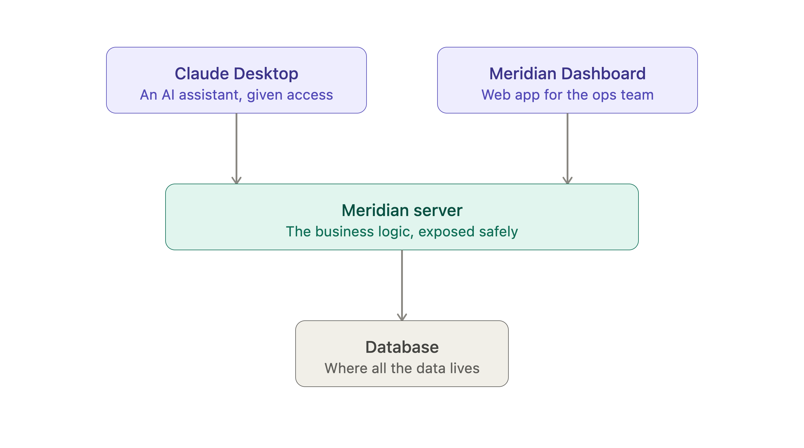

# Meridian Dashboard

A read-only ops dashboard for the Meridian MCP server: renewal risk,
active incidents, ticket search, and per-account drill-downs, all
rendered server-side against the server's live `/mcp` endpoint. Sibling
project to
[`meridian-fde-enterprise-demo`](https://github.com/ahmadmadar/meridian-fde-enterprise-demo)
(the MCP server itself), deployed independently.

- **Live:** https://meridian-dashboard-kappa.vercel.app/
- **MCP server:** https://meridian-mcp-server-k4ki.onrender.com

> Built using an AI-assisted delivery workflow (Claude Code): see
> [`docs/ai-assisted-delivery.md`](docs/ai-assisted-delivery.md) for what
> was generated versus decided by hand.

## How this fits together

This repo is a **read-only client** of the Meridian MCP server — it holds
no business logic of its own and talks only to the server's deployed
`/mcp` endpoint using a scoped, read-only API key.



See the server repo's
[`docs/architecture.md`](https://github.com/ahmadmadar/meridian-fde-enterprise-demo/blob/main/docs/architecture.md)
for the full technical depth: tool design, scoped auth, and the sequence
and class diagrams behind this picture.

## What this demonstrates

- A Next.js frontend calling an MCP server's tools directly from Server
  Components, with no API proxy layer for read-only data
- Structured error handling surfaced from the server's own error codes
  (`NOT_FOUND`, `FORBIDDEN_SCOPE`, etc.), not a generic crash page
- A scoped-down API key (`dashboard-readonly`): read access only, no
  write or admin capability, enforced by the server, not just by
  convention
- A chat feature scoped out deliberately rather than built by default:
  full reasoning is in the sibling repo's
  [`docs/architecture.md`](https://github.com/ahmadmadar/meridian-fde-enterprise-demo/blob/main/docs/architecture.md)
  ("Chat: scoped out")

## Screens

- **Renewal Risk** (`/renewal-risk`): portfolio-wide renewal risk via `get_renewal_risk`
- **Incidents** (`/incidents`, `/incidents/[id]`): active incidents and per-incident account impact via `list_active_incidents` and `check_incident_impact`
- **Tickets** (`/tickets`): filtered ticket search via `search_tickets`
- **Account drill-down** (`/accounts/[id]`): full account context via `get_account_360`

## Setup

```bash
npm install
cp .env.example .env.local   # fill in MCP_SERVER_URL and MCP_KEY_DASHBOARD
npm run dev
```

Both env vars are required: the app throws immediately on a missing one
rather than silently defaulting.

## Docs

- [`docs/ai-assisted-delivery.md`](docs/ai-assisted-delivery.md): build
  log, decisions, what got caught
- [Sibling repo's `docs/architecture.md`](https://github.com/ahmadmadar/meridian-fde-enterprise-demo/blob/main/docs/architecture.md):
  system-wide architecture, including this dashboard's role and the
  chat decision

## Status

Four read-only screens built and verified live against the deployed MCP
server: Renewal Risk, Incidents (with drill-in), Tickets, and Account
drill-down. Chat was scoped out (see architecture doc above), and no
automated test suite is planned for now (see
`docs/ai-assisted-delivery.md` for why). Deployed to Vercel.
